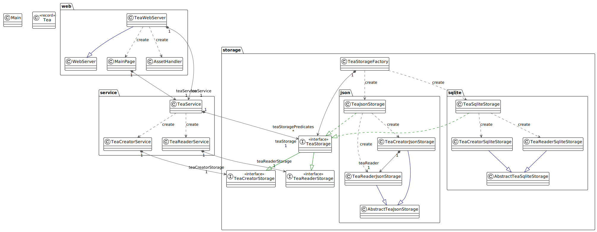

# Tea

**Java version:** 21

The idea of theis project is not to make a perfectly functional software 
but to show how to use simple design patterns to represent a basic development configuration.

Here, the application manage teas (I like tea) and stores them in a JSON file or in an SQLITE database.
It also creates a simple web server to display a webpage that can list the stored teas and add one. 
The idea is to demonstrate how we can abstract each layer of the application.

If you have any idea or suggestions to improve the codebase, feel free to open an issue or a PR!

If you have any question, you can also open an issue.

What can be improved:
- Exception management
- datasources initializations
- probably a lot more, a software is never perfect.

